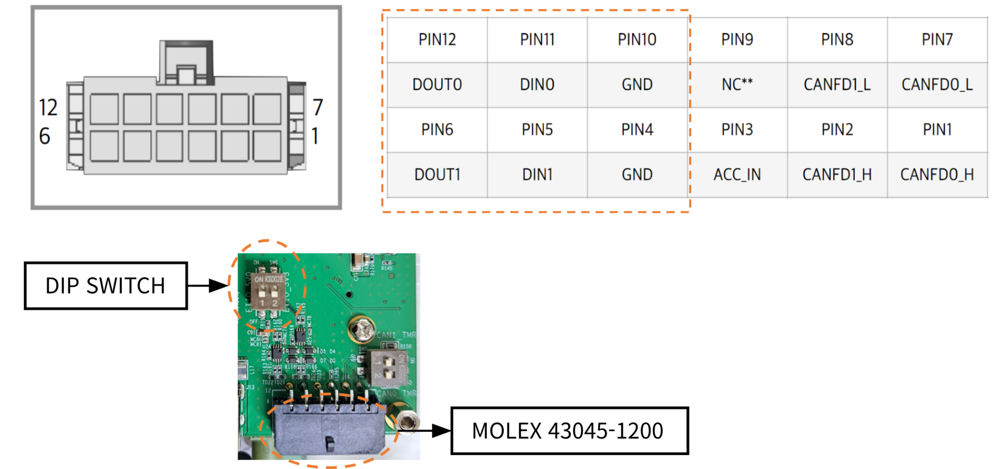

# GPIO



## 딥스위치(DIP Switch)

위 사진의 딥스위치는 GPIO 전압을 설정하는 핀입니다.

- **1번 스위치 ON**: 5V 입출력
- **2번 스위치 ON**: 3.3V 입출력

```{danger}
**주의**: 절대로 두 스위치를 동시에 ON으로 설정하지 마십시오. 3.3V와 5V가 단락되어 장치가 손상될 수 있습니다.
```

## 입력 하이 임계값

- **5V 기준**: 3.5V 이상
- **3.3V 기준**: 2.0V 이상

## 출력 최대 전류

- **20mA**

## GPIO 핀 번호 매핑

| GPIO   | 핀 번호 | GPIO 칩  |
|--------|---------|----------|
| DOUT0  | PCC.02  | gpiochip1 14 |
| DOUT1  | PCC.03  | gpiochip1 15 |
| DIN0   | PAA.04  | gpiochip1 4  |
| DIN1   | PAA.07  | gpiochip1 7  |
| EXT_SEL| PBB.01  | gpiochip1 9  |

## 멀티플렉서(Mux) 설정

EXT_SEL 설정을 통해 DIN0와 DOUT0를 GPIO 또는 카메라 프레임 동기화(FrameSync)로 사용할 수 있습니다.

- **EXT_SEL = 1**:
  - DIN0: GPIO
  - DOUT0: GPIO

- **EXT_SEL = 0**:
  - DIN0: 카메라 프레임 동기화 입력
  - DOUT0: 카메라 프레임 동기화 출력 (입력 신호를 그대로 전달)
  
## GPIO 설정 및 제어 가이드

JetPack 버전에 따라 GPIO를 설정하고 제어하는 방법이 다릅니다. 아래는 JetPack 5와 JetPack 6에서의 GPIO 사용 방법을 정리한 가이드입니다.

### JetPack 5에서의 GPIO 설정 및 제어

JetPack 5에서는 `/sys/class/gpio` 인터페이스를 통해 GPIO를 제어합니다. 다음은 GPIO를 활성화하고 방향을 설정하는 방법입니다.

1. **GPIO 활성화**:

   ```bash
   echo 330 > /sys/class/gpio/export
   echo 331 > /sys/class/gpio/export
   echo 320 > /sys/class/gpio/export
   echo 323 > /sys/class/gpio/export
   echo 325 > /sys/class/gpio/export
   ```

2. **GPIO 방향 설정**:

   ```bash
   echo out > /sys/class/gpio/gpio330/direction  # DOUT0: 출력
   echo out > /sys/class/gpio/gpio331/direction  # DOUT1: 출력
   echo in  > /sys/class/gpio/gpio320/direction  # DIN0: 입력
   echo in  > /sys/class/gpio/gpio323/direction  # DIN1: 입력
   echo out > /sys/class/gpio/gpio325/direction  # EXT_SEL: 출력
   ```

3. **GPIO 값 설정 및 읽기**:

   - **DOUT0 설정**:

     ```bash
     echo 1 > /sys/class/gpio/gpio330/value  # High
     echo 0 > /sys/class/gpio/gpio330/value  # Low
     ```

   - **DOUT1 설정**:

     ```bash
     echo 1 > /sys/class/gpio/gpio331/value  # High
     echo 0 > /sys/class/gpio/gpio331/value  # Low
     ```

   - **DIN0 값 읽기**:

     ```bash
     cat /sys/class/gpio/gpio320/value
     ```

   - **DIN1 값 읽기**:

     ```bash
     cat /sys/class/gpio/gpio323/value
     ```

   - **EXT_SEL 설정**:

     ```bash
     echo 1 > /sys/class/gpio/gpio325/value  # High
     echo 0 > /sys/class/gpio/gpio325/value  # Low
     ```

### JetPack 6에서의 GPIO 설정 및 제어

JetPack 6에서는 `libgpiod` 유틸리티를 사용하여 GPIO를 제어합니다. `gpioset`과 `gpioget` 명령어를 사용하여 GPIO의 값을 설정하거나 읽을 수 있습니다.

1. **DOUT0 설정**:

   ```bash
   gpioset -m hold gpiochip1 14=1  # High
   gpioset -m hold gpiochip1 14=0  # Low
   ```

2. **DOUT1 설정**:

   ```bash
   gpioset -m hold gpiochip1 15=1  # High
   gpioset -m hold gpiochip1 15=0  # Low
   ```

3. **DIN0 값 읽기**:

   ```bash
   gpioget gpiochip1 4
   ```

4. **DIN1 값 읽기**:

   ```bash
   gpioget gpiochip1 7
   ```

5. **EXT_SEL 설정**:

   ```bash
   gpioset -m hold gpiochip1 9=1  # High
   gpioset -m hold gpiochip1 9=0  # Low
   ```

```{tip}
`gpioset` 명령어는 기본적으로 실행 후 핀을 설정하고 종료되면 Low 상태로 돌아갑니다. 이를 방지하려면 `-m hold` 옵션을 사용하여 설정 상태를 유지할 수 있으며, 이 경우 명령어를 백그라운드에서 실행하거나 별도의 터미널 창에서 작업하는 것이 좋습니다. 자세한 내용은 `gpioset --help`를 통해 확인할 수 있습니다.
```

이 가이드를 통해 JetPack 5와 JetPack 6에서 GPIO를 설정하고 제어하는 방법을 익힐 수 있습니다. 각 버전에 맞는 방법을 사용하여 GPIO를 효과적으로 관리하시기 바랍니다.

