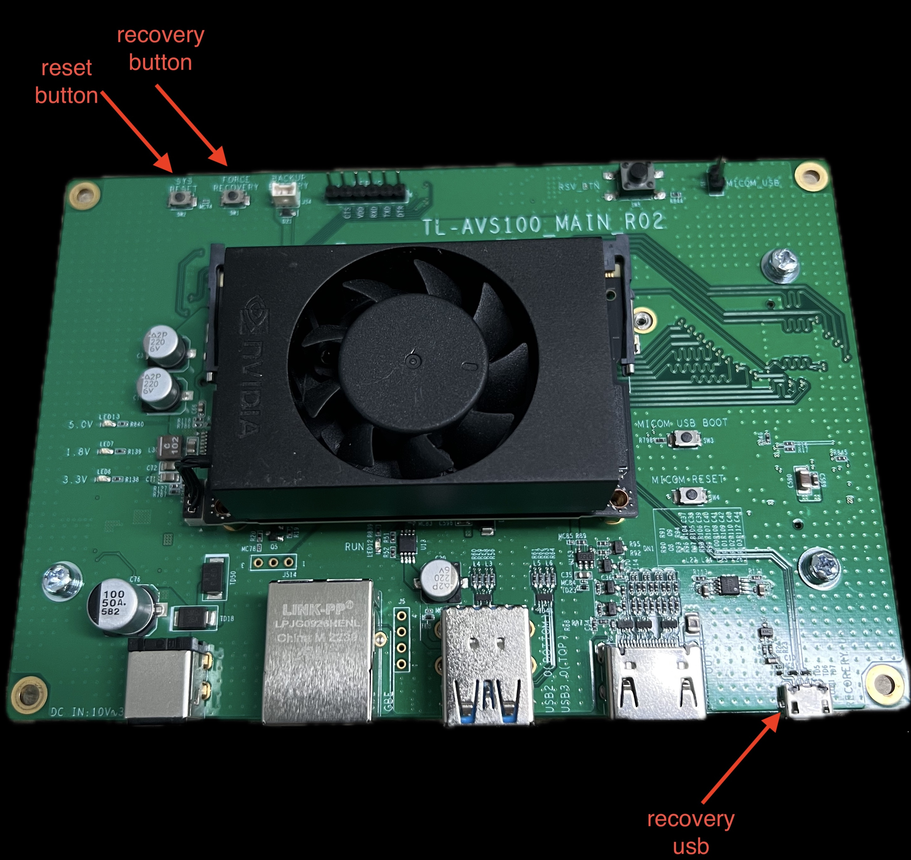
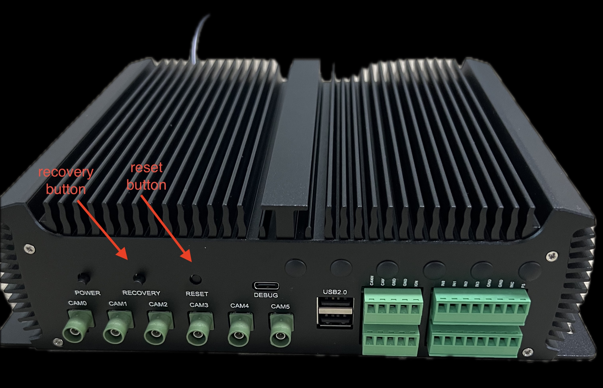
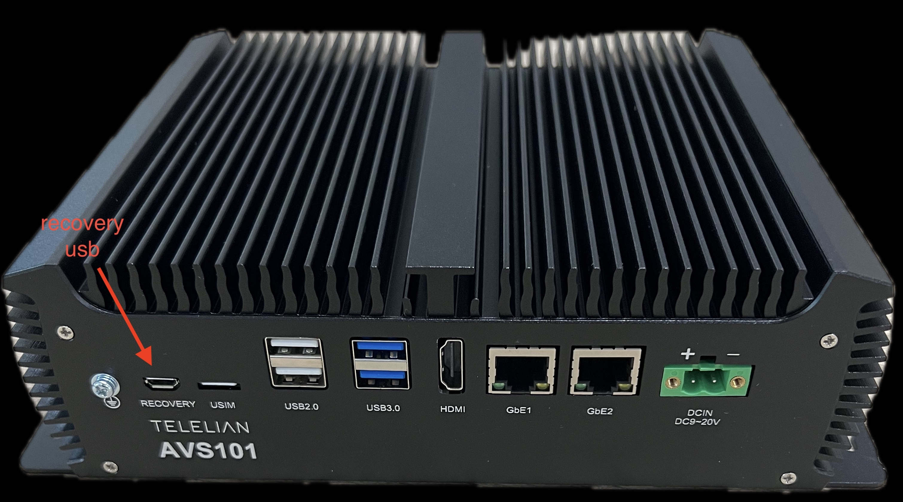
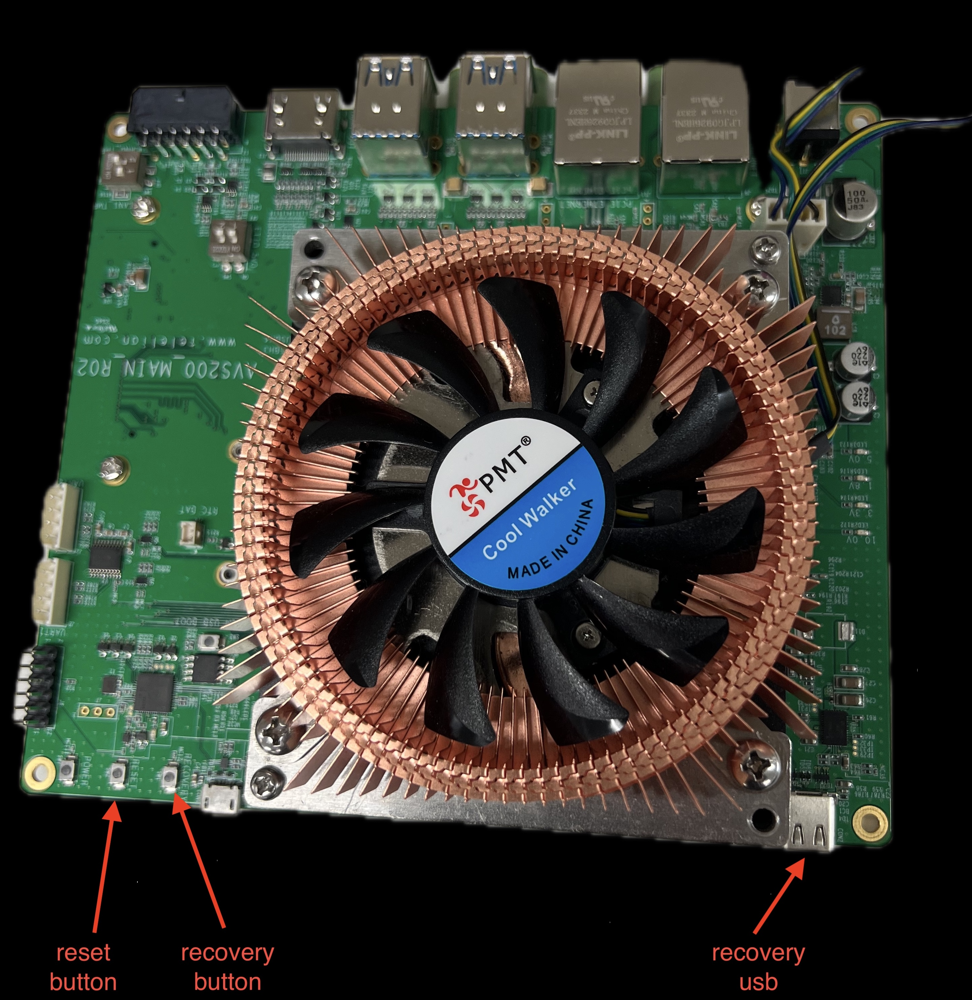

# Jetpack 6

## setup telelian l4t 

```{important}
## 지원하는 Linux for Tegra version은 아래와 같습니다.
    - 36.3 (Jetpack 6.0)
    - 36.4.3 (Jetpack 6.2)
## 출고시의 id와 password는 아래와 같습니다.
    - id : avs
    - password : telelian
```
```{warning}
## host는 ubuntu 20.04 또는 22.04를 사용하세요.
```

```bash
sudo apt update 
sudo apt install -y git-core build-essential libncurses5-dev \
bc bison flex libssl-dev fakeroot \
device-tree-compiler qemu-user-static debootstrap \
sshpass abootimg libxml2-utils \
nfs-kernel-server xmlstarlet

L4T_VERSION=36.4.3

BASE_PATH=$HOME/l4t_ws/$L4T_VERSION

mkdir -p $BASE_PATH
cd $BASE_PATH

wget https://gringrass.com/telelian-l4t/jp6/$L4T_VERSION/l4t_prebuilt.tar.gz -O $BASE_PATH/l4t_prebuilt.tar.gz

# Linux_for_Tegra download
case ${L4T_VERSION} in
    36.3)
        L4T_LINK=https://developer.nvidia.com/downloads/embedded/l4t/r36_release_v3.0/release/jetson_linux_r36.3.0_aarch64.tbz2
        L4T_FILE=jetson_linux_r36.3.0_aarch64.tbz2
        ROOTFS_LINK=https://developer.nvidia.com/downloads/embedded/l4t/r36_release_v3.0/release/tegra_linux_sample-root-filesystem_r36.3.0_aarch64.tbz2
        ROOTFS_FILE=tegra_linux_sample-root-filesystem_r36.3.0_aarch64.tbz2

        OVERLAY_LINKS=(
            https://developer.nvidia.com/downloads/embedded/L4T/r36_Release_v3.0/overlay_libcuda_36.3.tbz2
        )

        ;;
     36.4.3)
        L4T_LINK=https://developer.nvidia.com/downloads/embedded/l4t/r36_release_v4.3/release/Jetson_Linux_r36.4.3_aarch64.tbz2
        ROOTFS_LINK=https://developer.nvidia.com/downloads/embedded/l4t/r36_release_v4.3/release/Tegra_Linux_Sample-Root-Filesystem_r36.4.3_aarch64.tbz2
        ;;
esac

echo "Downloading Linux_for_Tegra"
wget ${L4T_LINK}
tar xpf ${L4T_FILE}

if [ -n "${OVERLAY_LINKS}" ]; then
    echo "Downloading overlays"
    for overlay in ${OVERLAY_LINKS[@]}; do
        echo "Downloading ${overlay}"
        wget ${overlay}
        tar xpf ${overlay}
    done
fi

echo "Downloading rootfs"
wget ${ROOTFS_LINK}
cd Linux_for_Tegra/rootfs
sudo tar xpf ${ROOTFS_FILE}


sudo ./apply_binaries.sh
# sudo ./tools/l4t_create_default_user.sh -u <username> -p <password> -n <hostname> -a --accept-license
# ex)
sudo ./tools/l4t_create_default_user.sh -u avs -p telelian -n avs-teleian -a --accept-license

cd $BASE_PATH
sudo tar xpf l4t_prebuilt.tar.gz

# depmod
cd $BASE_PATH/Linux_for_Tegra
sudo ./make_depmod.sh

```

## flash

### recovery mode
- Flash 하기 전 Recovery mode로 진입해야 합니다.
- recovery usb와 Linux_for_Tegra가 설치된 ubuntu PC를 연결합니다.
- Power on 상태에서 아래 사진에 표시된 recovery button을 누른 상태에서 reset button을 눌렀다 뗀 후 2-3초 후에 recovery button에서 손을 뗍니다.

#### avs100


#### avs101



#### avs200



### flash
- flash를 위한 기본 폴더는 아래와 같습니다.
    - Linux_for_Tegra/
- flash를 위한 명령어는 아래와 같습니다.

#### 공통
```bash
L4T_VERSION=36.4.3

BASE_PATH=$HOME/l4t_ws/${L4T_VERSION}
L4T_PATH=$BASE_PATH/Linux_for_Tegra
cd $L4T_PATH

```
#### avs100
```bash
# 최초 1회 flash
sudo ./flash_avs100_nvme.sh

# system image가 생성된 후 같은 이미지를 플래시 하는 경우
sudo ./flash_avs100_nvme_flash_only.sh
```

#### avs101
```bash
# 최초 1회 flash
sudo ./flash_avs101_nvme.sh

# system image가 생성된 후 같은 이미지를 플래시 하는 경우
sudo ./flash_avs101_nvme_flash_only.sh
```

#### avs200
##### emmc
```bash
# 최초 1회 flash
sudo ./flash_avs200_emmc.sh

# system image가 생성된 후 같은 이미지를 플래시 하는 경우
sudo ./flash_avs200_emmc_flash_only.sh
```

##### nvme
```bash
# 최초 1회 flash
sudo ./flash_avs200_nvme.sh

# system image가 생성된 후 같은 이미지를 플래시 하는 경우
sudo ./flash_avs200_nvme_flash_only.sh
```


## target device 설정

### 최초 부팅 후 설정 
- target device booting한 후 터미널에서 설정합니다.
- group설정
    ```bash
    sudo usermod -aG gpio <user-id>
    sudo usermod -aG i2c <user-id>
   ```
- nvpmodel 설정
    - orin의 성능 설정을 최대로 설정합니다.
    - 설정 후 yes를 입력하면 재부팅됩니다.
    ```bash
    sudo nvpmodel -m 0
    ```

### gstreamer 설치
```bash
sudo apt install -y nvidia-l4t-gstreamer
```

### jetpack 설치
```bash
sudo apt install nvidia-jetpack
```

### jtop 설치
```bash
sudo apt install python3-pip
sudo -H pip3 install -U jetson-stats
sudo systemctl restart jtop
```


## Build Telelian l4t

### 문의 
- [sales@telelian.com](mailto:sales@telelian.com)